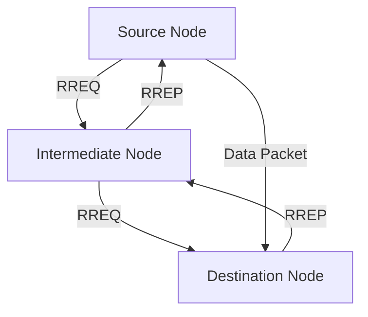

## 🚀 Introduction
The **Ad hoc On-Demand Distance Vector (AODV)** routing protocol is a cornerstone of wireless ad hoc networks, including **Vehicular Ad Hoc Networks (VANETs)**. It dynamically establishes routes only when required, optimizing network efficiency.

---

## 🌟 Key Features of AODV
- **Reactive Routing**: Creates routes **on-demand**, reducing overhead from unused paths.
- **Route Discovery**: Utilizes **Route Request (RREQ)** and **Route Reply (RREP)** messages for efficient route setup.
- **Route Maintenance**: Ensures robust communication via **Route Error (RERR)** messages.
- **Sequence Numbers**: Guarantees up-to-date routes while avoiding loops.

---

## 💡 How AODV Works

1. **Route Discovery**:
   - The source node broadcasts a **RREQ** to find the destination.
   - Each intermediate node forwards the RREQ until it reaches the destination.

2. **Route Reply**:
   - The destination sends back a **RREP** to establish the path.

3. **Data Transmission**:
   - Data packets are sent through the established route.

4. **Route Maintenance**:
   - Link failures trigger **RERR** messages to repair or remove routes.

---

## 🔑 AODV Parameters

| **Parameter**          | **Description**                                           |
|------------------------|-----------------------------------------------------------|
| **Active Route Time**  | Time a route remains active without usage.                |
| **Delete Period (DPC)**| Wait time before removing a broken route.                 |
| **Sequence Numbers**   | Ensures fresh, loop-free routing paths.                   |

---

## 🛠️ Tools for Simulation

AODV is often evaluated using powerful simulation tools:

- **NS-3**: Modular network simulation framework with AODV support.
- **SUMO**: Simulates realistic vehicular mobility for VANET scenarios.
- **OSM**: Provides real-world map data for accurate modeling.

---

## 📊 Performance Metrics

Key metrics for evaluating AODV performance include:

- **Packet Delivery Ratio (PDR)**: Percentage of packets successfully delivered.
- **Throughput**: Total successful data delivery rate.
- **End-to-End Delay**: Average time for a packet to reach its destination.

---

## 🌈 Advantages and Limitations

### ✅ Advantages
- Minimal overhead due to on-demand routing.
- Adaptable to dynamic network topologies.
- Supports both unicast and multicast communication.

### ❌ Limitations
- Initial route discovery introduces latency.
- Performance may degrade in dense or highly mobile networks.
- Scalability issues in very large networks.

---

## 🎯 Conclusion
The **AODV routing protocol** is vital for dynamic and efficient communication in ad hoc and vehicular networks. While it has limitations, its adaptability and simplicity make it a preferred choice for many applications.

---

**🔗 Related Resources**:
- [RFC 3561: AODV Specification](https://www.rfc-editor.org/rfc/rfc3561)
- [NS-3 AODV Documentation](https://www.nsnam.org/docs/models/html/aodv.html)

**Tags**: `#AODV`, `#VANET`, `#Routing`, `#NS3`
