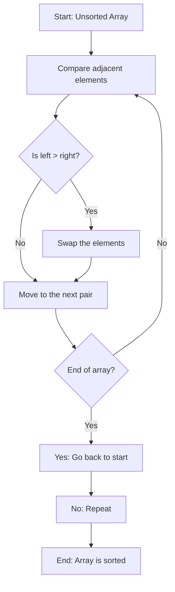

# Python

## Bubble Sort

### 다이어그램


### 설명
- **Start**: 배열의 초기 상태에서 시작합니다.
- **비교**: 인접한 두 요소를 비교합니다.
- **교환**: 왼쪽 값이 오른쪽 값보다 크면 두 요소를 교환합니다.
- **다음 쌍으로 이동**: 인접한 다음 쌍을 검사합니다.
- **끝 확인**: 배열 끝에 도달했는지 확인합니다.
- **반복**: 끝에 도달했으면 다시 처음부터 반복합니다.
- **완료**: 더 이상 교환이 필요하지 않으면 종료합니다.

---

### 예시 코드
``` python
def bubble_sort(arr):
    n = len(arr)
    for i in range(n):
        # 이미 정렬된 요소를 제외하고 반복
        for j in range(0, n-i-1):
            # 인접 요소 비교
            if arr[j] > arr[j+1]:
                # 교환
                arr[j], arr[j+1] = arr[j+1], arr[j]
    return arr

# 테스트용 배열
arr = [64, 34, 25, 12, 22, 11, 90]
sorted_arr = bubble_sort(arr)
print("Sorted Array:", sorted_arr)

```
### 코드 설명
- **입력 배열의 길이** :
	- 배열의 길이를 n으로 설정.
- **반복분**:
	- 외부 반복문은 정렬이 끝난 요소를 제외한 나머지 배열을 처리.
	- 내부 반복문은 인접한 두 요소를 비교.
- **조건** :
	- 왼쪽 값이 오른쪽 값보다 크면 두 값을 교환.
- **결과**:
	- 모든 요소가 정렬될 때까지 반복.

### 출력
테스트 배열 [64, 34, 25, 12, 22, 11, 90]의 정렬 결과는:
```javascript
Sorted Array: [11, 12, 22, 25, 34, 64, 90]
```
