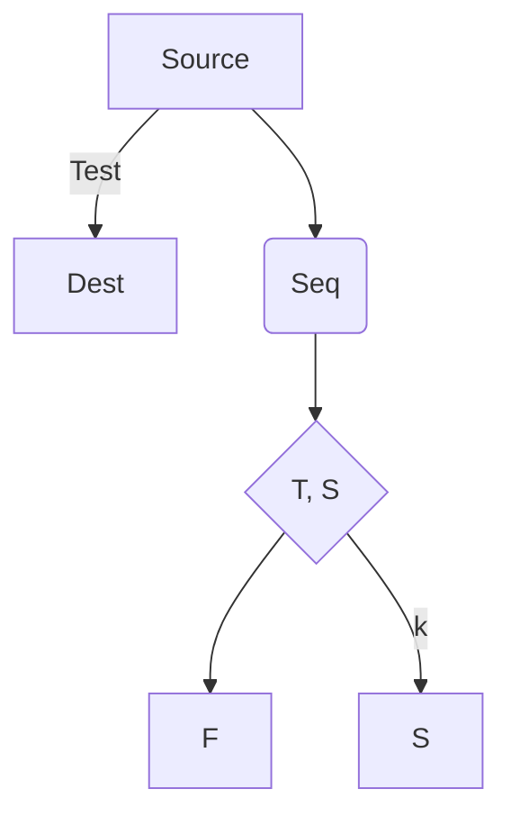

# Python

## Bubble Sort
 - 연산자


```mermaid
graph TD

A[Source] --> |Test| B[Dest]
A[Source] --> C(Seq) --> D{T, S}
D{T, S} --> F
D --> |k|S
```

``` python
import matplotlib.pyplot as plt

def test(self, name) :
	print('Test')
	return name

print(test('Test'))
```